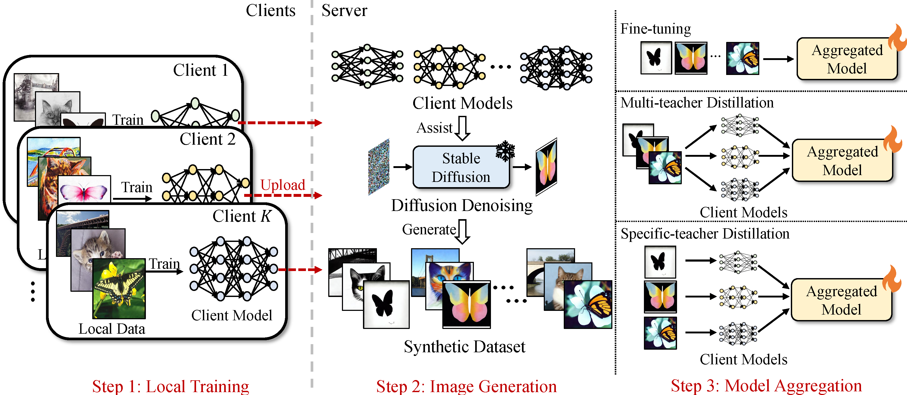

# FedLMG

The pytorch implementation of FedLMG: One-Shot Heterogeneous Federated Learning with Local Model-Guided Diffusion Models (Accepted by ICML-25).

## Requirements

	pip install -r requriements.txt

## 1.Train local classifiers

	bash train_classifier.sh

## 2.Generating synthetic datasets

	bash generate_images.sh

## 3.Obtain the aggregated model

	bash aggregate.sh

# BibTex

	@misc{yang2025oneshotheterogeneousfederatedlearning,
	      title={One-Shot Heterogeneous Federated Learning with Local Model-Guided Diffusion Models}, 
	      author={Mingzhao Yang and Shangchao Su and Bin Li and Xiangyang Xue},
	      year={2025},
	      eprint={2311.08870},
	      archivePrefix={arXiv},
	      primaryClass={cs.CV},
	      url={https://arxiv.org/abs/2311.08870}, 
	}

[Arxiv Link](https://arxiv.org/abs/2311.08870)