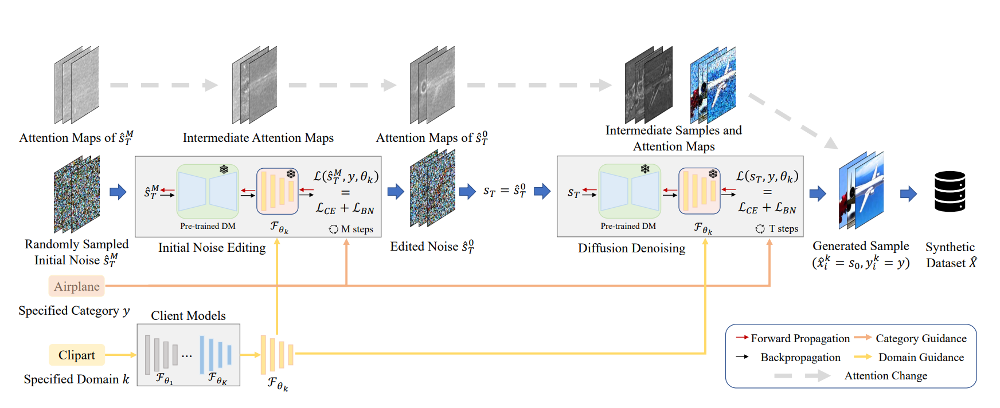

## FedCADO

This repository is the implementation of FedCADO (Classifier-Assisted Diffusion for One-shot Federated learning method). Our paper will be released soon.

FedCADO opens up new possibilities for federated learning by leveraging pre-trained diffusion models enriched with knowledge. In FedCADO, the server employs classifiers trained by individual clients for classifier-guided diffusion, enabling the server to generate data that complies with the client's distribution.

With the vast knowledge within the pre-trained diffusion models, it becomes possible to generate samples with both more diversity and quality than the original client data, with the great possibility of surpassing the ceiling performance of centralized training.

## Requirements

	pip install -r requriements.txt

## 1.Train local classifiers

	bash train_classifier.sh

## 2.Generating synthetic datasets

	bash generate_images.sh

## 3.Obtain the aggregated model

	bash aggregate.sh

## Pre-trained Diffusion Model

The pre-trained diffusion model primarily used in our method is [Stable Diffusion v1-5](https://huggingface.co/runwayml/stable-diffusion-v1-5/tree/main).

